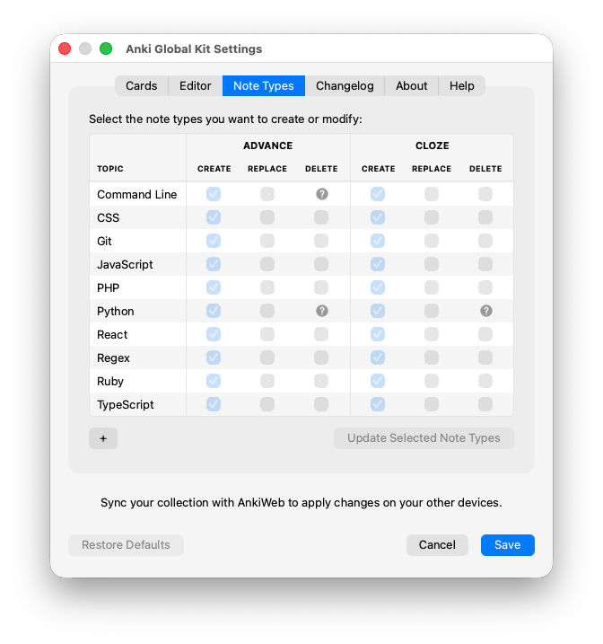
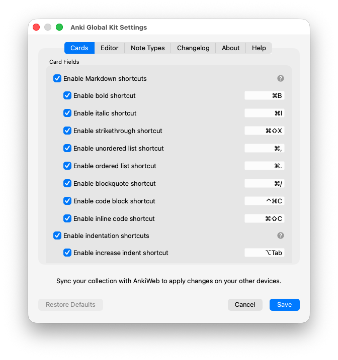
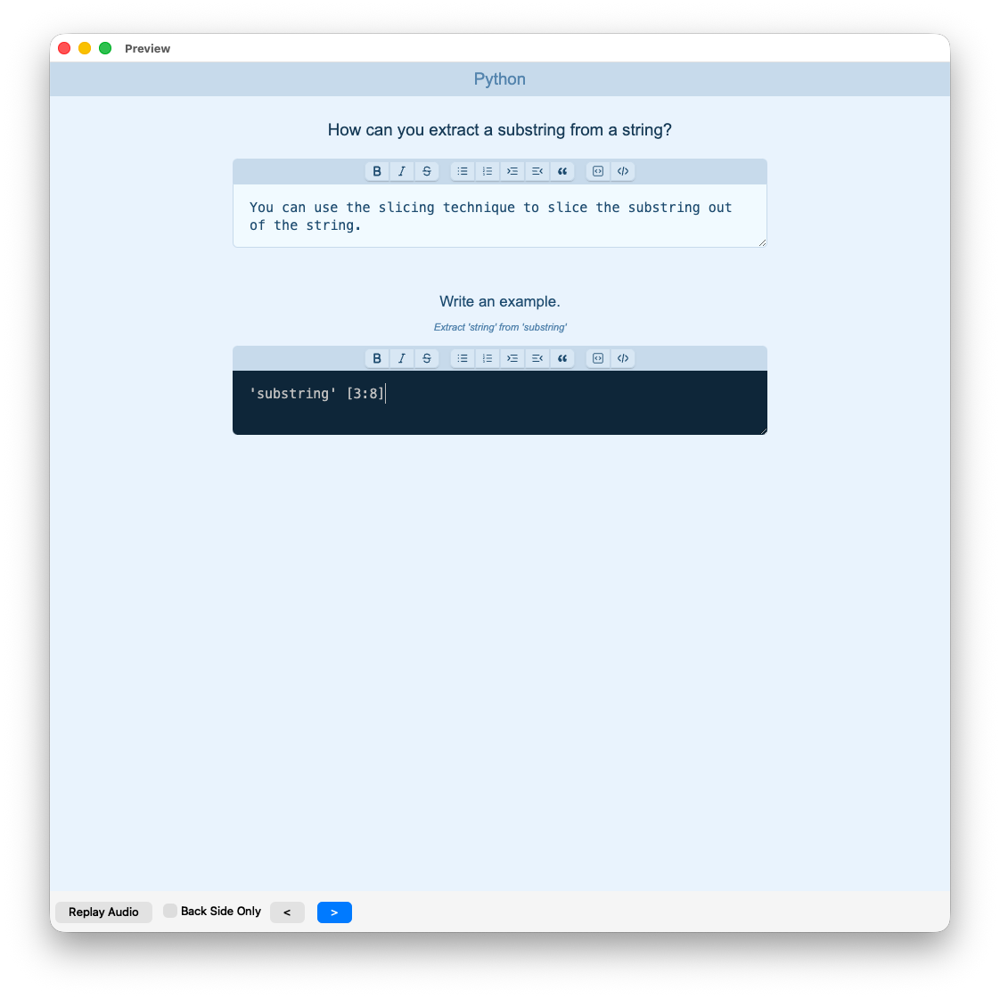
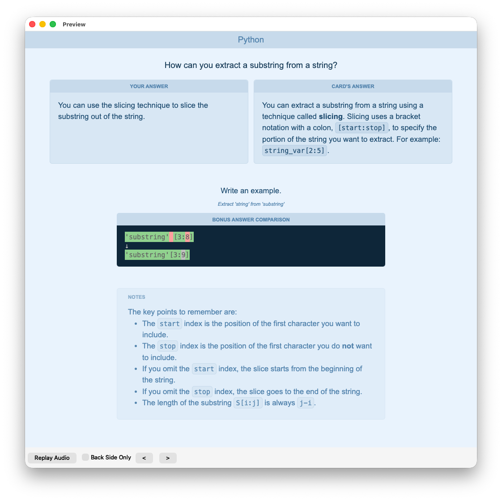
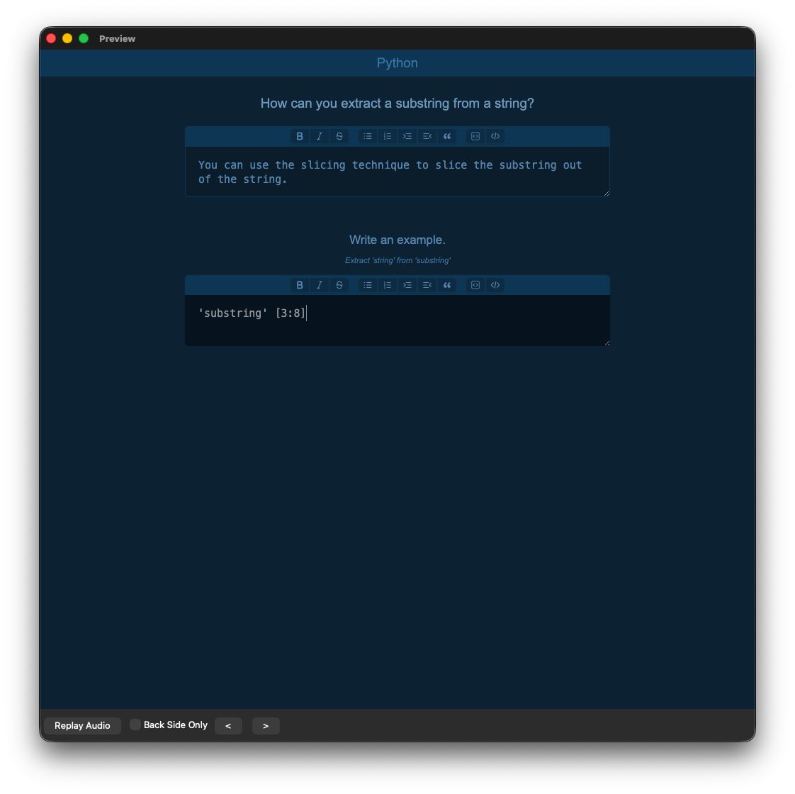
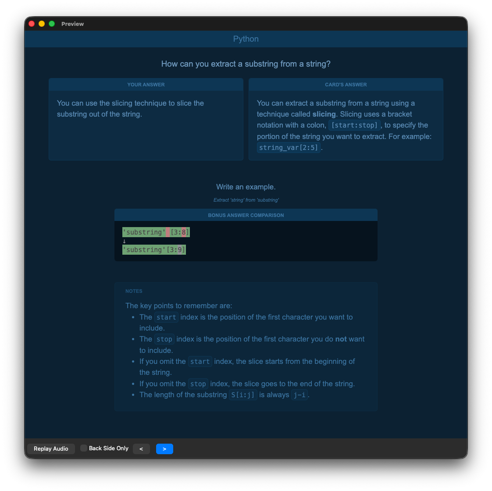
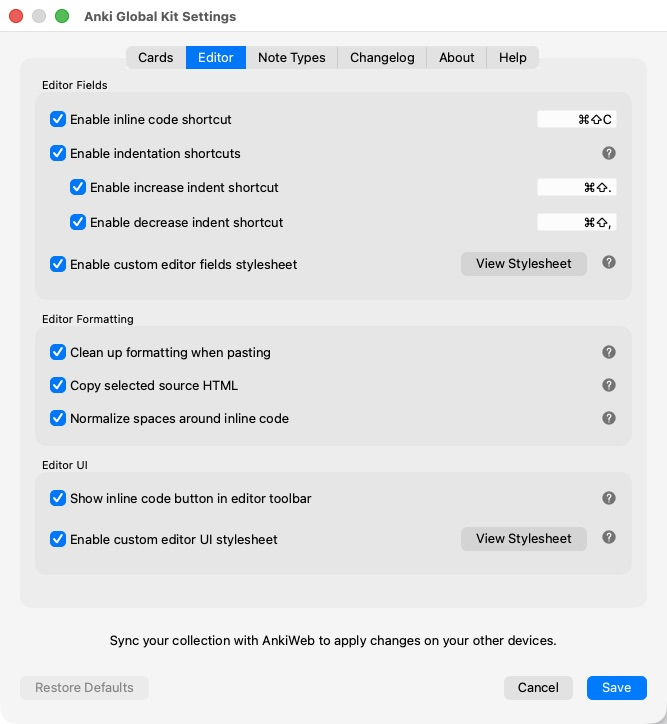
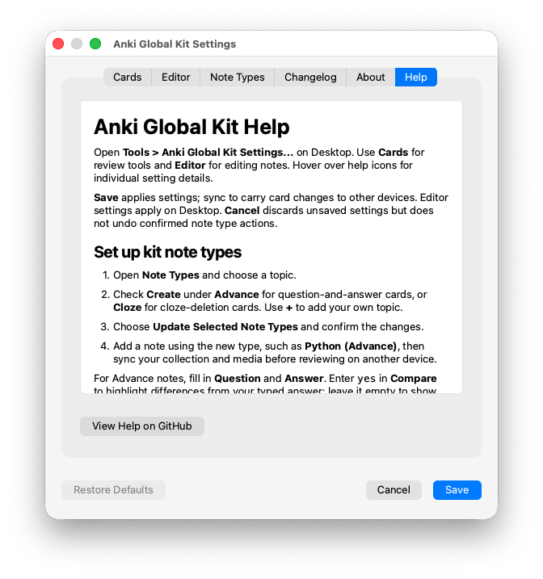

# Anki Global Kit

Anki Global Kit is an Anki Desktop add-on for creating reusable card templates, formatting typed answers with Markdown, highlighting code, comparing answers, and customizing the Desktop editor.

Install and configure the kit on Desktop, then sync your collection and media to use its card features in AnkiWeb, AnkiMobile, and AnkiDroid. Editor tools and the settings panel run on Desktop.

For setup details, shortcuts, customization, and troubleshooting, read the [user guide (HELP.md)](addon/HELP.md). The same guide is available in the Anki Global Kit Settings panel's **Help** tab.

## Setup

1. Install [Anki Desktop](https://apps.ankiweb.net/). Install the kit using its AnkiWeb download code through **Tools > Add-ons > Get Add-ons**, or choose **Install from file** for a packaged `.ankiaddon` file. Restart Anki after installation. See the [Anki add-on instructions](https://docs.ankiweb.net/addons.html); to build a package from this repository, see **Development** below.
2. Open **Tools > Anki Global Kit Settings... > Note Types**. Check **Create** for the topics and formats you want: **Advance** for question-and-answer cards or **Cloze** for cloze-deletion cards. Use **+** to add a custom topic.
3. Choose **Update Selected Note Types** and confirm. Add a note using a new type, such as **Python (Advance)** or **CSS (Cloze)**.
4. Adjust review tools in **Cards** and Desktop editing tools in **Editor**, then choose **Save**.
5. Sync the collection and media from Desktop, then sync your other devices before reviewing there.

The add-on automatically installs or refreshes its managed card scripts, stylesheets, and font in the active profile when it opens, when you switch profiles, and when you save settings. You do not need to copy media files or card templates manually for newly created kit note types.

### Create and update note types

Built-in topics include Command Line, CSS, Git, JavaScript, PHP, Python, React, Regex, Ruby, TypeScript, Vocabulary, and WordPress. Custom topics use the kit's default styling.

- **Create** adds a missing note type. Existing types are detected and checked automatically.
- **Replace** updates an existing type's kit templates and styling after explicit selection and confirmation. Notes and fields are kept, missing kit fields are added, and custom card templates may be replaced.
- **Delete** removes an empty note type or an uncreated custom topic. Types containing notes cannot be deleted through this panel.

Choose **Update Selected Note Types** to apply these actions. **Save** applies settings separately; **Cancel** does not undo confirmed note type changes. Pending action checkboxes are not retained across restarts, while custom topics remain available.

The **Note Types** tab lists the available topics and lets you choose which Advance or Cloze types to create, replace, or delete. Use **+** to add a custom topic.



### Add your first note

For an **Advance** note, fill in **Question** and **Answer**. Enter `yes` in **Compare** to highlight differences between your typed answer and the reference; leave it empty to display the answers separately. **Type Hint**, bonus question and answer fields, and **Notes** are optional. **Bonus Compare** enables comparison for the bonus answer.

For a **Cloze** note, use **Cloze Question** and Anki's cloze-deletion tools. The primary typed answer is compared automatically; bonus fields and notes are optional.

### After an add-on update

Restart Anki Desktop so the updated card assets are installed, then sync the collection and media. Existing note templates are not updated automatically. If you want to apply the latest kit templates, select **Replace** for the relevant types in **Note Types** and confirm.

## Features

### Typed answers and comparison

- Multiline answer inputs, optional bonus questions, type hints, and notes.
- Typed answers retained for display on the card back, including AnkiDroid's review flow.
- Character-by-character answer comparison showing matching text, mistakes, and omissions, with Unicode characters kept intact.
- **Alt+Tab** to indent Markdown list items and physical **Control+Tab** to unindent by default. Enable, disable, or customize each under **Cards → Card Fields → Enable indentation shortcuts**. Alt+Tab indents the current or selected rows by four spaces for Python topics and two otherwise; Control+Tab removes leading indentation. **Tab** and **Shift+Tab** retain native focus navigation.
- Reveal answers with **Control+Enter** on Windows/Linux Desktop and AnkiWeb, or **Command+Enter** on macOS Desktop.

### Markdown and code

Submitted answers can render headings, paragraphs, line breaks, nested lists, blockquotes, fenced code blocks, inline code, bold, italics, strikethrough, and HTTP(S) links.

Use the optional formatting toolbar above card inputs or configure shortcuts in **Cards**. Increase indent and decrease indent buttons appear after the ordered list button and before blockquote; they work independently of their shortcut enable switches. Each shortcut and toolbar button can be enabled individually. Word formatting applies to selected text or the word at the caret; applying it again removes the markers. List conversion preserves nested items' indentation and list styles.

Code blocks use the language written after the opening backticks, such as `python`, or infer a language from the topic. Supported languages and aliases include Python, JavaScript/Node, TypeScript, Java, C, C++, C#, SQL, Bash/shell, JSON, Ruby, Go, Rust, and PHP. Comparison and syntax highlighting are bundled with the kit.

The **Cards** settings tab controls review-time Markdown formatting shortcuts and indentation behavior.



### Card presentation

- Responsive layouts for questions, answers, comparison panels, cloze deletions, hints, bonus sections, and notes.
- Shared typography and light/dark palettes, including distinct comparison colors.
- Topic accent colors and customizable card styling through the note type stylesheet.
- AnkiWeb study menu layout adjustments.

The front shows the question, typed answer fields, formatting toolbar, and optional hint. On the back, the typed answer appears alongside the card's answer; bonus comparison and notes can appear below. These examples use a Python Advance note in light and dark themes.

| Front of card | Back of card |
| --- | --- |
|  |  |
|  |  |

### Desktop editor

- Inline-code formatting through a configurable shortcut and optional toolbar button.
- Indentation, inline-code space normalization, source HTML copying, and rich-text paste cleanup.
- List buttons and shortcuts change only the outermost selected list level, preserving child styles and indentation. Plain indented rows become nested lists. **Alt+Tab** and physical **Control+Tab** indent and unindent list items by default. Under **Editor → Editor Fields → Enable indentation shortcuts**, enable, disable, or customize the increase indent and decrease indent shortcuts separately. In plain text, Alt+Tab adds four leading spaces to the current or selected rows and Control+Tab removes leading indentation. The caret stays with the original text. **Tab** and **Shift+Tab** retain native focus navigation.
- Add or remove a blockquote at the current indentation level with the toolbar button or **Command+/** on macOS (**Control+/** on Windows/Linux).
- Physical **Control+Shift+C** for Cloze on macOS, leaving the default **Command+Shift+C** shortcut available for inline code.
- Separate custom stylesheets for editor fields and the surrounding UI. Use **View Stylesheet** in the **Editor** tab to open `user_files/editor-fields.css` or `user_files/editor-ui.css`, then restart Anki after editing. These files are preserved during add-on upgrades.

The **Editor** settings tab controls inline code and indentation shortcuts, paste cleanup, source HTML copying, and custom editor styling.



## Templates

The add-on assembles topic-specific note types from packaged HTML, script, and styling parts. See the [template guide](addon/templates/README.md) and [template parts](addon/templates/note-types/parts/) to inspect or adapt them. Use the settings panel to create note types without assembling templates manually.

## Development

From the repository root, install dependencies, build the card and editor assets, check asset paths, and create an installable package:

```sh
npm install
npm run build:addon
npm run check:assets
npm run package:addon
```

Install `dist/anki-global-kit.ankiaddon` through Anki Desktop's **Tools > Add-ons > Install from file**, then restart Anki. Use `npm run watch` to rebuild assets while editing; rebuild the package when reinstalling changes.

Desktop Python code lives under `addon/desktop`, card sources under `src/cards`, editor sources under `src/editor`, and shared sources under `src/shared`. Runtime note type parts live under `addon/templates/note-types/parts`.

See [publishing instructions](docs/dev/PUBLISHING.md) for packaging and AnkiWeb release steps.

## Help and feedback

Read [HELP.md](addon/HELP.md) for settings guidance and common problems, or open the **Help** tab in **Anki Global Kit Settings...**. For an unresolved problem, [report an issue](https://github.com/jacobcassidy/anki-global-kit/issues) with your Anki version, device, and steps to reproduce it. See the [changelog](CHANGELOG.md) for release notes.



## License

[MIT](LICENSE)
